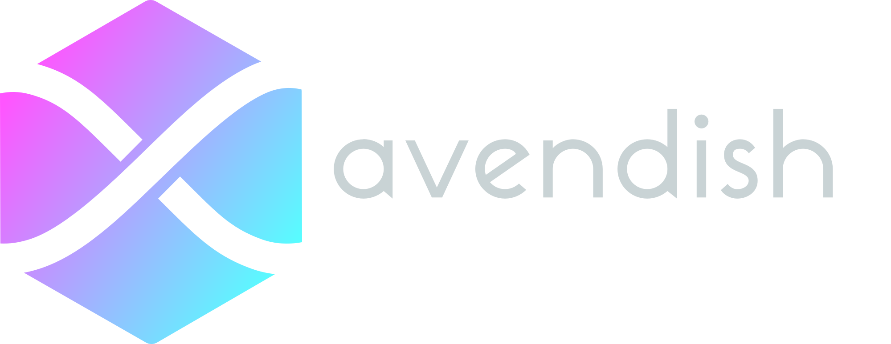

<h1 align="center">
   <br/>
</h>

# declarative polyamorous cross-system intermedia objects

 [](https://github.com/sponsors/jcelerier)    [](https://github.com/celtera/avendish/actions/workflows/build_cmake.yml)

A zero-cost, compile-time, reflection-based, pure C++ solution to the quadratic glue MxN problem:

 * M host environments: DAW plug-in APIs, PureData, Max/MSP, etc.
 * N algorithms.
 * M x N binding code required.

The [original blog post](https://ossia.io/posts/reflection/) contains the motivation and some implementation details.

## Features

This library is a proof-of-concept (based on the Boost.PFR library and a couple of tricks),
which showcases how with what little reflection modern C++ provides, it is possible to:

 - Automatically generate Python bindings for a C++ class (by leveraging [pybind11](https://github.com/pybind/pybind11)).
 - Automatically generate OSC / OSCQuery bindings for a C++ class (through [libossia](https://github.com/ossia/libossia)).
 - Automatically generate small user interfaces for C++ classes like e.g. Unity3D does (an example is provided with Qt).
 - Automatically generate audio plug-ins in a legacy API as an example.
 - Automatically generate Max/MSP and PureData objects.

Unlike many other reflection solutions in C++, this library has two properties:

 - It is entirely non-intrusive. The effects do not even need to include a single header. All the types are introspected from the content of the provided classes ; this library embraces protocols / traits / typeclass-based design mainly thanks to C++ concepts.
   - This is in order to enable at a later point easy targetting of bare-metal platforms.
   - This also ensure that implementations are not dependent of any "reflection" library, only of whatever facilities C++ compilers provide. This is done to provide a perfect separation of concern and make sure that the algorithms will still be easily useable in 20 years, like e.g. when done in Faust.
   - No macro are required to declare the types, etc. No specific function call is necessary. Just write the raw algorithm with its inputs and outputs, optionally add some metadata to make things nicer for the end-user in environments that support them (e.g. value ranges, etc) and you're done.

 - It is entirely done at compile-time through pure C++ mechanisms. No external code generator / scanner à la Qt's moc is used, no forked version of libclang is necessary, etc etc. Instead, it expects types to conform to various concepts corresponding to common multi-media use-cases.
   - As far as it's possible there is zero run-time cost over the equivalent C code. Everything that can be allocated statically, is. There is no run-time mapping of parameters to string, enums, etc. outside of what the host APIs do require.

The current catch is that types being introspected must be aggregates. This is not a very hard restriction in practice and allows for plenty of useful things.

The API is not as clean as it could be - the end-goal would be to have the meta-class and compile-time programming papers merged in the C++ standard in order to remove the remaining little boilerplate there is and open the use-cases & lift various dumb restrictions:

 - http://www.open-std.org/jtc1/sc22/wg21/docs/papers/2018/p0707r3.pdf
 - https://en.cppreference.com/w/cpp/experimental/meta/P1717
 - [Current metaclass compiler](https://cppx.godbolt.org/)

Committee if you hear us :)

## Dependencies

- A C++20 compiler (tested with clang-12 and gcc-11 ; GCC still has a couple bugs). MSVC [does not implement the necessary features yet](https://developercommunity.visualstudio.com/t/requires-clause-in-constexpr-if-doesnt-work/929394).
  If you don't have one you can use the [ossia SDK](https://github.com/ossia/sdk/releases/tag/sdk21) which provides clang-12 & libc++ for Windows / Mac / Linux.
- [Boost.PFR](https://github.com/boostorg/pfr) : note that the library does not depend on the rest of Boost.
- (optional) fmtlib. Provides nicer printing in some places.
- (optional) pybind11.
- (optional) Max SDK to make Max externals.
- (optional) PureData headers to make Pd externals.
- (optional) Qt & [Verdigris](https://github.com/woboq/verdigris)  to make QML UIs. Verdigris is a pure-C++ alternative to moc.
- (optional) [libossia](https://github.com/ossia/libossia) to make an OSCQuery API.

## Examples

See https://github.com/celtera/avendish/tree/main/examples for a list of examples.

Here is an example of various Max/MSP & PureData objects generated from the examples folder ; the patches are available in https://github.com/celtera/avendish/tree/main/docs.


## Usage

The simplest way to get started is to take a look at the examples, and clone the [template repository](https://github.com/celtera/avendish-audio-processor-template).

A recent enough clang version is provided for all platforms (check the CI scripts in `.github/workflows/cmake`).

### Audio processor

A most basic avendish audio processor would look like this:

```C++
#pragma once
struct Distortion
{
  static consteval auto name() { return "Distortion"; }
  static consteval auto c_name() { return "disto"; }
  static consteval auto uuid() { return "dd4dd880-d525-44fb-9773-325c87b235c0"; }

  struct {
    struct {
      static consteval auto name() { return "Preamp"; }
      static consteval auto control() {
        struct {
          const float min = 0.001;
          const float max = 1000.;
          const float init = 1.;
        } c; return c;
      }

      float value{0.5};
    } preamp;

    struct {
      static consteval auto name() { return "Volume"; }
      float value{1.0};
    } volume;
  } inputs;

  void operator()(double** in, double** out, int frames)
  {
    const double preamp = inputs.preamp.value;
    const double volume = inputs.volume.value;

    for (int c = 0; c < channels; c++)
      for (int i = 0; i < frames; i++)
        out[c][i] = volume * std::tanh(in[c][i] * preamp);
  }
};
}
```

It will create for instance an audio plug-in with two parameters.

The next example will create a PureData object which:
 - can be initialized with either one float, two floats or a string,
 - can be sent a `bamboozle` message which will work with the arguments specified in the C++ function declaration
 - will perform an addition between its two inlets.

```C++
#pragma once
struct Addition
{
  static consteval auto name() { return "Addition"; }
  static consteval auto c_name() { return "avnd_addition"; }
  static consteval auto uuid() { return "36427eb1-b5f4-4735-a383-6164cb9b2572"; }

  struct {
    struct { float value; } a;
    struct { float value; } b;
  } inputs;

  struct {
    struct { float value; } out;
  } outputs;

  struct {
    struct {
      static consteval auto name() { return "member"; }
      static consteval auto func() { return &Messages::bamboozle; }
    } member;
  } messages;

  void bamboozle(float x, float y, const char* str)
  {
    inputs.a.value = x;
    inputs.b.value = y;
  }

  static constexpr std::tuple initialize{
      [] (Init& self, float a) { std::cout << "A: " << a << std::endl; }
    , [] (Init& self, const char* a, const char* b) { std::cout << "B: " << a << b << std::endl; }
  };

  void operator()()
  {
    outputs.out.value = inputs.a.value + inputs.b.value;
  }
};
```

A small library of helpers types and macros is provided to simplify the most common use-cases but is in no way mandatory.

## Advanced features

As this library currently focuses on the "concept" of an audio effect processor or synthesizer, it provides various amenities tailored for that use case:

 - It's possible to write processors either in a mono, per-sample or multi-channel, per-buffer (and various variations) fashion:

```C++
void operator()(double** in, double** out, int frames) { /* my audio code */ }

float operator()(float in) { /* my audio code */ }

... etc ...
```

If a mono processor is written, the library will wrap it automatically in the case of a multichannel requirement from the host.

 - An example of automatically wrapping controls in `std::atomic` in order to provide thread-safe access to controls is implemented in one of the backends.
   Ultimately, this should be something configurable by the user: a Python binding should not have to pay the cost of atomic access, but an audio plug-in
   with an UI must be thread-safe.

# Past travel

 - A first tentative in [ossia score](https://github.com/ossia/score/tree/master/src/plugins/score-plugin-fx/Fx) based on std::tuple and automatic deduction of function arguments.
 - [vintage](https://github.com/jcelerier/vintage) explored Boost.PFR for creating audio plug-ins
 - This was applied back on the [API](https://github.com/jcelerier/score-simple-api-2/) for [ossia](https://ossia.io) plug-ins.
 - And here we are :-)

# Future directions

 - Continue porting the concepts developed in https://github.com/jcelerier/score-simple-api-2/ ; in particular for CPU-based image processing. Extend to e.g. Krita plug-ins.
 - Implement concepts for GPU-based processing.
 - Have a basic UI story.
 - Improve the handling of callbacks.
 - WebAudio backend.
 - WASM component backend: https://radu-matei.com/blog/intro-wasm-components/
 - Port many effects :-)
   * https://github.com/pcastine-lp/LitterPower
   * https://github.com/MTG/essentia/tree/master/src/algorithms
   * https://github.com/cycfi/q/tree/master/q_lib/include/q
   * https://github.com/VCVRack/Fundamental/tree/v1/src
   * https://github.com/BespokeSynth/BespokeSynth/tree/main/Source
   * https://github.com/LMMS/lmms/tree/master/plugins
   * https://github.com/leomccormack/Spatial_Audio_Framework
   * https://github.com/micknoise/Maximilian
   * https://github.com/jamoma
   * https://github.com/v7b1/vb-objects
   * https://github.com/thestk/stk
   * https://github.com/TonicAudio/ofxTonic
   * https://github.com/mhamilt/AudioEffectsSuite
   * https://github.com/mohabouje/eDSP
   * https://github.com/LabSound/LabSound
   * https://github.com/porres/pd-else
   * https://github.com/free-audio/clap
   * etc...


# Licensing

The library is licensed under GPLv3+[commercial](https://celtera.dev/). The concepts are licensed as permissively as possible (any of Boost license, public domain, BSD0, CC0, you name it) as it's mainly the concepts which enable interoperability. The end goal being that people who make, e.g. plug-in specs provide their own generators based on these concepts, to make sure that we have a thriving interoperable ecosystem.
