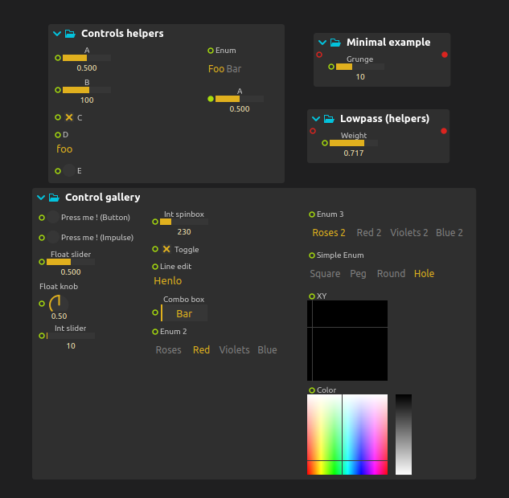
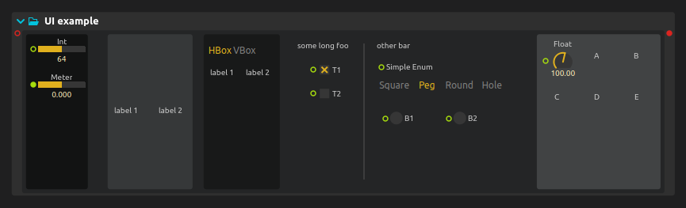
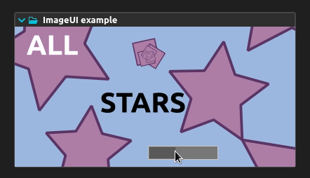

# Creating user interfaces

We have seen so far that we can specify widgets for our controls. Multiple back-ends may render these widgets in various ways.
This is already a good start for making user interfaces, but most media systems generally have more specific user interface needs.

Avendish allows four levels of UI definition:

1. Automatic: nothing to do, all the widgets corresponding to inputs and outputs of the processor will be generated automatically in a list. This is not pretty but sufficient for many simple cases. For instance, here is how some Avendish plug-ins render in *ossia score*.

> Supported bindings: all, not really a feature of Avendish per-se but of the hosts




2. Giving layout hints. A declarative syntax allows to layout said items and text in usual containers, auomatically and with arbitrary nesting: hbox, vbox, tabs, split view... Here is, again, an example in *ossia score*.

> Supported bindings: ossia, and the plug-in editors (CLAP, VST2, VST3) through the
> built-in software UI runtime (Nuklear widgets + canvas_ity rasterizer, embedded
> with pugl — no GPU or extra framework needed).



3. Creating entirely custom items with a Canvas-based API. It is also possible to load images, make custom animations and handle mouse events.

> Supported bindings: ossia, WebAssembly (Canvas2D), and the plug-in editors
> (CLAP, VST2, VST3) — the same `paint()` code renders through QPainter,
> HTML5 Canvas or the software rasterizer.



4. Shipping an entirely custom editor written with **any UI framework**, through
   the `ui::window` escape hatch:

```cpp
struct ui {
  struct window {
    void open(avnd::gui_parent parent, avnd::gui_host host); // host's native window handle
    void close();
    void idle();                                             // host UI-thread tick
    std::pair<int, int> size() const;
  };
};
```

The bindings hand `open()` the host-provided parent window (HWND / NSView /
X11 window) and a set of automation-gesture callbacks
(`begin_edit` / `perform_edit` / `end_edit`); anything can be created inside —
Dear ImGui, Qt, JUCE, or raw platform code. See
`examples/Advanced/UI/CustomUiWindow.hpp` for a complete plug-in whose editor
is a plain Win32 window, built as CLAP, VST2 and VST3 from the same file.

> Supported bindings: CLAP, VST2, VST3

## Previewing UIs without a host

`avnd_make_ui_preview(TARGET ... MAIN_FILE ... MAIN_CLASS ... C_NAME ...)`
builds a small executable that opens the plug-in's editor in a plain window —
no DAW needed (`--frames N` exits after N cycles, for CI smoke tests). In the
browser, `avnd/binding/ui/soft/wasm.hpp` + `avnd-soft-ui.js` blit the same
software framebuffer into a `<canvas>`; on microcontrollers see
`examples/platforms/esp32-ui/`.