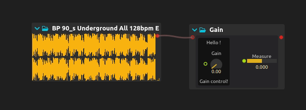

# Making media objects with [Avendish](https://github.com/celtera/avendish)

This book is two things: a tutorial for the usage of [Avendish](https://github.com/celtera/avendish), intertwined with 
an explanation of the concepts and implementation.

Avendish aims to enable media objects / processors authors to write the processor in the most natural way possible, and then to map this to host softwares or languages with so-called zero-cost abstraction.

> By zero-cost abstraction, we mean zero run-time cost. However, we'll see that the system actually enables extremely short compile times compared to the norm in C++.

The library is borne from:

- The necessity to reduce duplication among media processors in C++. 

- Allowing to express the quintessence of a given media processor.
    * There should be no compromise at any point: the user of the library must be able to declare all the properties, inputs, outputs of a media processor, whether it processes audio, video, MIDI, asynchronous messages, etc...
    * The way this is expressed should be the simplest possible way in C++, in the sense that the code should be as natural as possible: just declaring variables should be sufficient. The lack of proper reflection in C++ still limits this in a way, but we will see that it is already possible to get quite far !
    * For a given processor, multiple potential expressions are possible. We aim to capture most possible expressions: for instance, it may be more natural for a given audio processor to implement it in a sample-wise way (each audio sample processed one-by-one), and for another to be implemented through buffer-wise processing.
  
- The observation that the implementation of a media processor has no reason of depending on any kind of binding library: those are two entirely orthogonal concerns. Yet, due to how the language works, for the longest time writing such a processor necessarily embedded it inside some kind of run-time framework: JUCE, DPF, iPlug, etc. These frameworks are all great, but also all make compromises in terms of what is possible to express. Data types will be limited to a known list, UI will have to be written with a specific UI framework, etc. In contrast, Avendish processors are much more open ; processors can be written in their "canonic" form. The various bindings will then try to map as much as is possible to the environments they are bound to.

In addition, such frameworks are generally not suitable for embedded platforms such as micro-controllers, etc. JUCE does not work on ESP32 :-) 

In contrast, Avendish processors can be written in a way that does not depend on *any* existing library, not even the standard C or C++ libraries, which makes them trivially portable to such platforms. The only required thing is a C++ compiler, really!

# Why C++

To ease porting of most effects, which are also in C++. Step by step, we will be able to lift them towards maybe higher-level descriptions, but first I believe that having something in C++ is important to allow capturing the semantics of the vast majority of media processors in existence.

Also because this is the language I know best =p

Non-C++ alternatives exist: [Faust](https://faust.grame.fr/) and [SOUL](https://soul.dev/) are the two most known and are great inspirations for Avendish ; they focus however mainly on audio processing. Avendish can be used to make purely message-based processors for e.g. Max/MSP and PureData, Python objects, etc. or video processing objects (currently implemented only for [ossia score](https://ossia.io), but could easily be ported to e.g. Jitter for Max, GEM for PureData, etc.).

# What is really Avendish

1. An ontology for media objects.
2. An automated binding of a part of the C++ object semantics to other languages and run-time environments.
3. An example implementation of this until C++ gets proper reflection and code generation features.
4. Very, very, very, very uncompromising on its goals.
5. Lots of fun C++20 code !

# GIMME CODE

Here's an example of a complete audio processor which uses an **optional** library of helper types:

```cpp
struct MyProcessor {
  // Define generic metadata
  halp_meta(name, "Gain");
  halp_meta(author, "Jean-Michaël Celerier");
  halp_meta(uuid, "3183d03e-9228-4d50-98e0-e7601dd16a2e");

  // Define the inputs of our processor
  struct ins {
    halp::dynamic_audio_bus<"Input", double> audio;
    halp::knob_f32<"Gain", halp::range{.min = 0., .max = 1.}> gain;
  } inputs;

  // Define the outputs of our processor
  struct outs {
    halp::dynamic_audio_bus<"Output", double> audio;
    halp::hbargraph_f32<"Measure", halp::range{-1., 1., 0.}> measure;
  } outputs;

  // Define an optional UI layout
  struct ui {
    using enum halp::colors;
    using enum halp::layouts;
    halp_meta(name, "Main")
    halp_meta(layout, hbox)
    halp_meta(background, mid)

    struct {
      halp_meta(name, "Widget")
      halp_meta(layout, vbox)
      halp_meta(background, dark)

      const char* label = "Hello !";
      halp::item<&ins::gain> widget;
      const char* label2 = "Gain control!";
    } widgets;

    halp::spacing spc{.width = 20, .height = 20};

    halp::item<&outs::measure> widget2;
  };

  // Our process function
  void operator()(int N) {
    auto& in = inputs.audio;
    auto& out = outputs.audio;
    const double gain = inputs.gain;

    double measure = 0.;
    for (int i = 0; i < in.channels; i++)
    {
      for (int j = 0; j < N; j++)
      {
        out[i][j] = gain * in[i][j];
        measure += std::abs(out[i][j]);
      }
    }

    if(N > 0 && in.channels > 0)
      outputs.measure = measure / (N * in.channels);
  }
};
```

Here is how it looks like when compiled against the [ossia score](https://ossia.io) backend:

